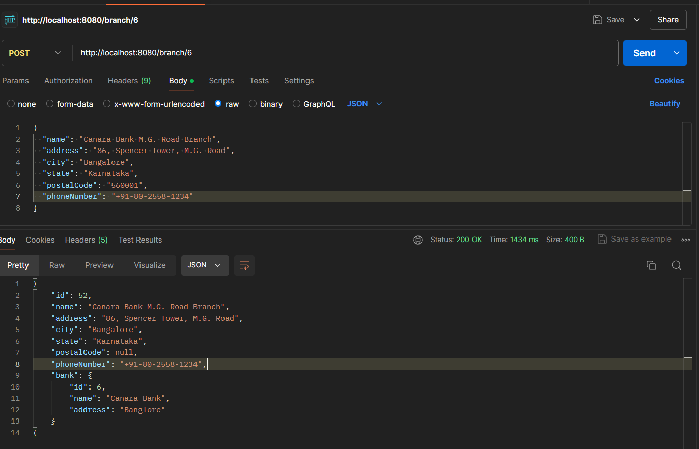
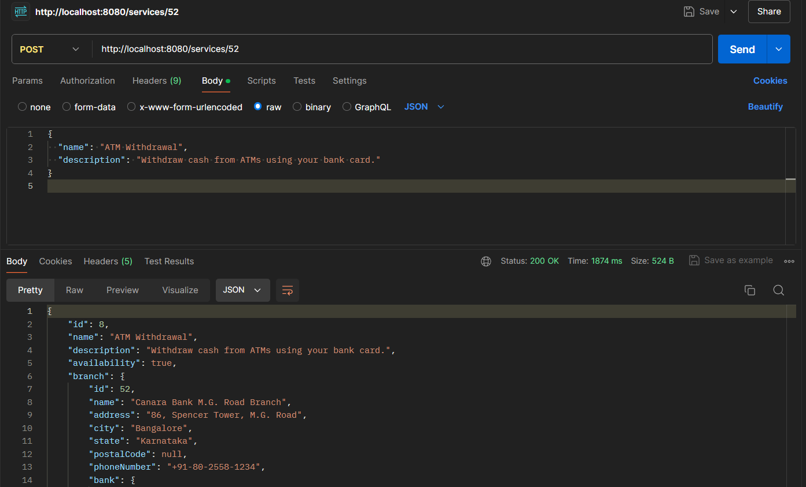
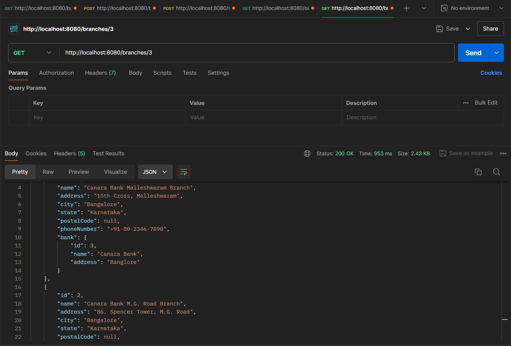
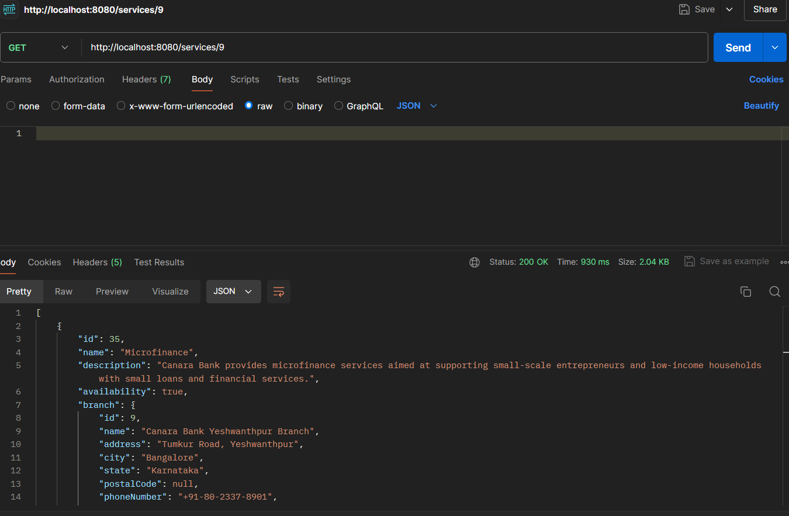

# Canara Bank API Documentation

# Canara Bank API Documentation

**Note:** The project is deployed on Render as a free service. It may spin down due to inactivity, causing request delays of 50 seconds or more. Please be patient if you experience delays.

**Active Link for the Project:** [https://bankmanage-ui.vercel.app/](https://bankmanage-ui.vercel.app/)

**Front-End Repository:** [https://github.com/rock-02/bankmanage-ui](https://github.com/rock-02/bankmanage-ui)

## 1. Create a Bank

To create a new bank, use the POST method with the following request body:

**Request URL:** `http://localhost:8080/bank`

```json
{
  "name": "Canara Bank",
  "address": "Banglore"
}
```


## 2. Create a Branch

To create a new branch, use the POST method with the following request body:

**Request URL:** `http://localhost:8080/branch/{bankId}`

```json
{
  "name": "Canara Bank HSR Layout Branch",
  "address": "27th Main, HSR Layout",
  "city": "Bangalore",
  "state": "Karnataka",
  "postalCode": "560102",
  "phoneNumber": "+91-80-2572-3456"
}
```



## 3. Create a Branch Service

To Add a new Service to branch, use the POST method with the following request body:

**Request URL:** `http://localhost:8080/services/{branchId}`

```json
{
  "name": "Canara Bank HSR Layout Branch",
  "address": "27th Main, HSR Layout",
  "city": "Bangalore",
  "state": "Karnataka",
  "postalCode": "560102",
  "phoneNumber": "+91-80-2572-3456"
}
```



## 4. Get Branches of Bank

Get Branhces of bank

**Request URL:** `http://localhost:8080/branches/{bankId}`



## 5. Get Services offered by of Branch

Get Services offered By Branch

**Request URL:** `http://localhost:8080/services/{branchId}`


