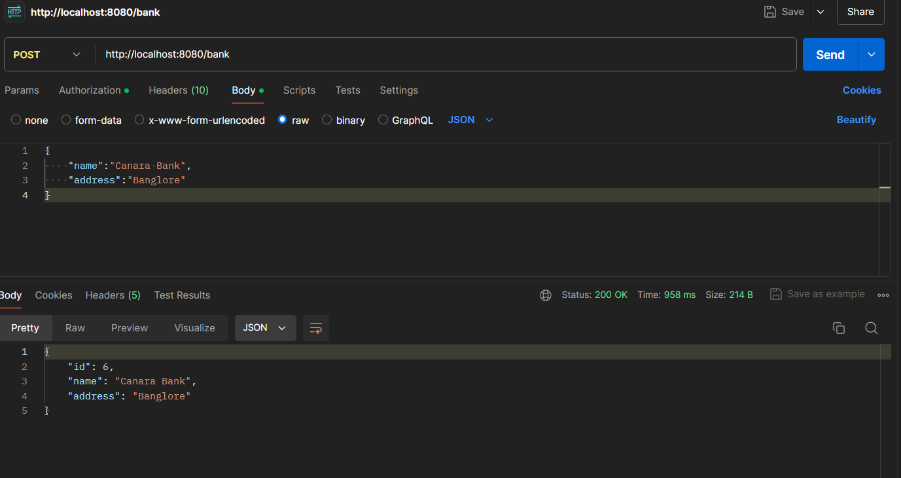
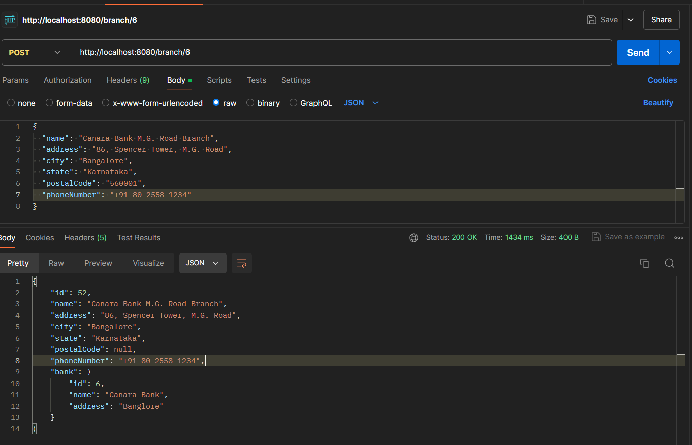
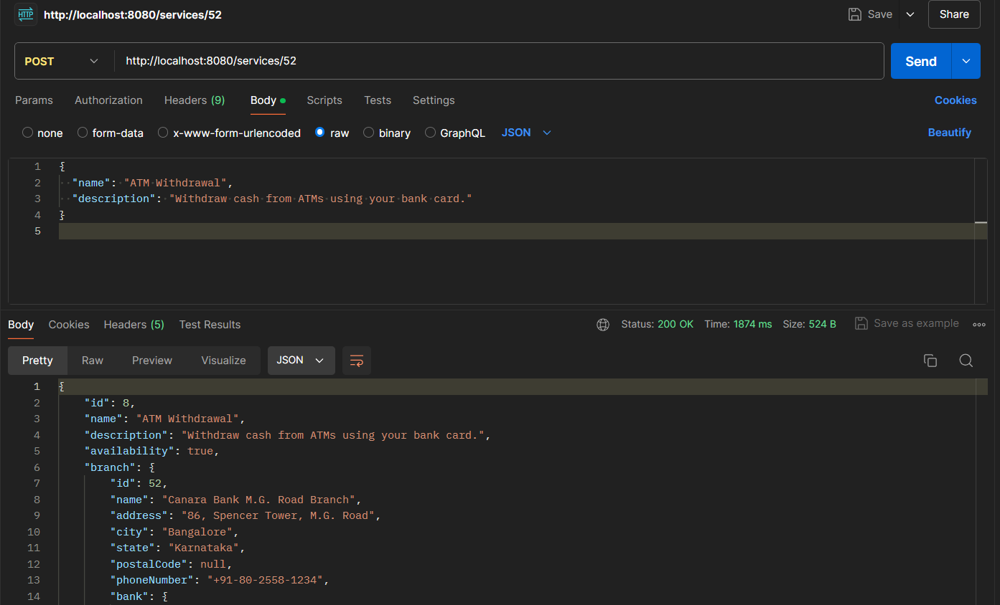
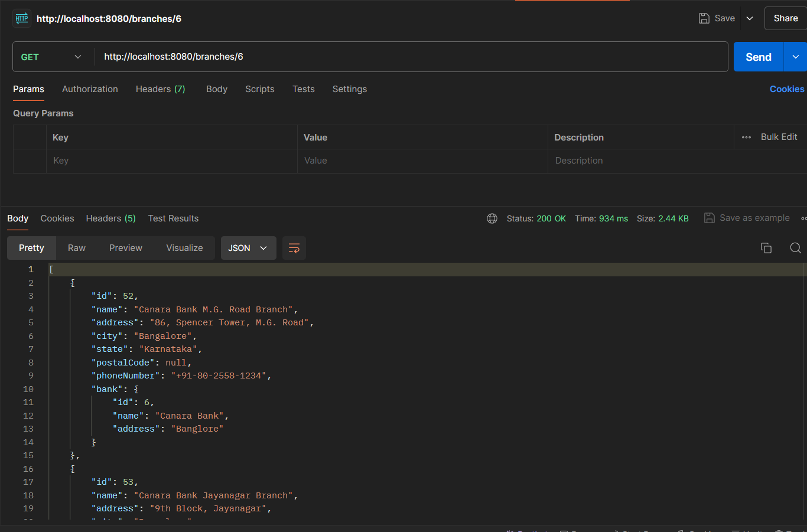

# Canara Bank API Documentation

## 1. Create a Bank

To create a new bank, use the POST method with the following request body:
url :"http://localhost:8080/bank"
```json
{
  "name": "Canara Bank",
  "address": "Banglore"
}










```
